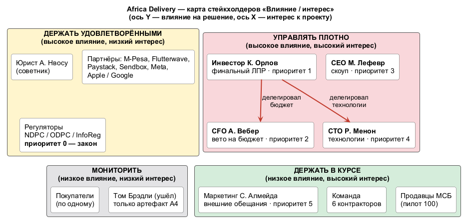

# Матрица стейкхолдеров

**Дата (время кейса):** 2026-08-14. **Источники:** A1–A8, У (см. [README](../README.md)).

## Чей голос решающий

Решает **инвестор К. Орлов**: он единственный акционер и финансирует проект. Часть прав он явно делегировал:

- **деньги → CFO**: «Анна покажет тебе цифры, с Анной не спорь» (A1). У Анны право вето на любую позицию дороже $500/мес и на найм (A6 п.2, п.5);
- **технологии → CTO вместе с архитектором**: «Раджеш, сами договоритесь. Технологии — твоя зона» (A1);
- **неделегируемые условия инвестора**: 15 октября, «данные в стране», выплата продавцам в тот же день, «дёшево» (A7).

**Порядок разрешения конфликтов:** закон и регулятор → неделегируемые условия инвестора → бюджет CFO → скоуп CEO → технологические предпочтения CTO → обещания маркетинга. Закон стоит выше инвестора: штраф или запрет на работу перечёркивают и дату, и бюджет.

## Матрица

| # | Стейкхолдер (роль) | Ключевые интересы (источник) | Влияние | Интерес | Приоритет при конфликте | Коммуникация |
|---|---|---|---|---|---|---|
| 1 | Регуляторы: NDPC, ODPC и CA (Кения), Information Regulator (внешний ЛПР, вето по закону) | Локализация ПДн, согласия, регистрация, DPO (A3 п.1–3) | Очень высокое | Низкий до инцидента | **0** — не обсуждается | Через юриста и DPO |
| 2 | **К. Орлов**, инвестор (финальный ЛПР) | 15.10, «не падает», данные в стране, выплаты в тот же день, дёшево (A1, A7) | Очень высокое | Высокий | **1** | Одна страница по-английски; звонок 1:1; живой дашборд (A1, A2) |
| 3 | **Анна Вебер**, CFO (вето на расходы) | ≤ $5k/мес, без предоплат и лицензий, ≤ 2,5% GMV, 6 контракторов (A6) | Высокое | Высокий | **2** | Письменно: TCO, КП и альтернатива по позициям > $500 (A6 п.2) |
| 4 | **Марк Лефевр**, CEO (владелец скоупа после ухода PM) | Граница первого релиза; опыт Jumia — «год» (A1) | Высокое | Высокий | **3** | Еженедельный скоуп-ревью, решения письменно |
| 5 | **Раджеш Менон**, CTO (технический ЛПР) | Микросервисы, K8s, Kafka, Oracle, Go, build-not-buy, 99,99% (A5) | Высокое | Очень высокий | **4** | 1:1 до Найроби, черновик ADR, спор на цифрах TCO |
| 6 | **София Алмейда**, маркетинг (внешние обязательства) | Кампания $180k, обещания в креативах, сторы к 01.10, SMS по 410 тыс. (A2) | Среднее | Высокий | **5** | Еженедельный синк, список поддержанных обещаний |
| 7 | **Адаезе Нвосу**, юрист (советник) | Осторожность, ответ через 4–6 недель, почасовая оплата (A3) | Высокое — через закон | Средний | Советник по п.0 | Письменные вопросы пакетом с дедлайном |
| 8 | Партнёры: M-Pesa, Paystack, Flutterwave, Sendbox, перевозчик KE, Meta, SMS-агрегатор, сторы | API, KYC, сроки онбординга, комиссии (У) | Высокое — через сроки go-live | Низкий | Ограничение, не голос | Договоры, sandbox, онбординг |
| 9 | Продавцы МСБ (100 в пилоте) | Деньги «сегодня», простой онбординг, WhatsApp/USSD (A1, A2) | Низкое по одному | Высокий | Через CEO | Пилот 10–15 продавцов в Лагосе вместо интервью (A1) |
| 10 | Покупатели (город и село) | Доверие, цена, мегабайты, 3G (A2) | Низкое по одному | Средний | Через метрики | Метрики, отзывы, SMS-опросы |
| 11 | Команда: 6 контракторов | Реалистичный скоуп, дежурства без выгорания | Среднее — осуществимость | Высокий | — | Ежедневно; ADR и диаграммы как код |
| — | Том Брэдли, бывший PM | Автор A4, не стейкхолдер («забудь про него», A1) | Нет | — | — | Список A4 — вход, не скоуп |

## Диаграмма «Влияние / интерес»

Исходник: [stakeholder-map.puml](stakeholder-map.puml). Стратегии по квадрантам: **управлять плотно** (инвестор, CFO, CEO, CTO) — пресогласование 1:1 и ADR; **держать удовлетворёнными** (регуляторы, партнёры, юрист) — требования без сюрпризов; **держать в курсе** (маркетинг, продавцы, команда) — статус и демо; **мониторить** (покупатели) — метрики.

## Assumptions

- **AS-03.** Head of Marketing подчиняется CEO, поэтому вопросы по рекламным обещаниям адресуем CEO.
- **AS-04.** В MVP участвуют регуляторы Нигерии (NDPC) и Кении (ODPC). Information Regulator ЮАР — после пилота (У «Цели бизнеса»). Регистрацию в NDPC и назначение DPO нужно начать до запуска (A3 п.1).
