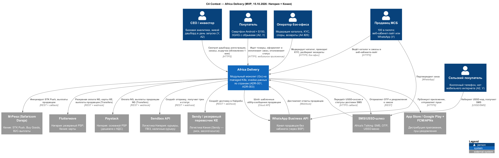

# Architecture Vision — Africa Delivery

**Дата (время кейса):** 2026-08-18. **Структура** — [приложение Б](../templates/architecture-vision-template.md). **Статус:** к защите в Найроби 20.08.2026.

## 1. Проблема и цели бизнеса

Мультикатегорийный маркетплейс «низкая цена × объём» на рынке, где 60%+ трафика — мобильный 3G/4G, а банковскими картами пользуются около 20% (У). Ни документации, ни команды пока нет, а реклама на $180k уже оплачена (A2).

| Горизонт | Цель | Измеримый критерий |
|---|---|---|
| **15.10.2026** (MVP) | Пилот в Нигерии и Кении: 5 000 SKU / 100 продавцов, оплата M-Pesa и Flutterwave, SMS и мессенджеры, кабинет покупателя, аналитика для CEO (У) | Перевод слов инвестора «работает 16.10» (A1): **покупают** — ≥ 1 000 оплаченных заказов/день к концу 2-й недели; **продавцы получают деньги** — 99% выплат в течение 24 ч после подтверждённой доставки; **не ломается** — SLO оформления заказа 99,9%; **министр не звонит** — 0 записей ПДн нигерийцев вне Нигерии |
| 12 мес. | 5 стран, 1 млн+ пользователей, B2B, кабинет продавца, track & trace, возвраты, защита ПВЗ, 3+ языка (У) | ИТ-стоимость заказа ≤ $0,55; SLO 99,9% → 99,95% с началом Г2 |
| 3 года | 12–15 стран, 40% рынка (A1, A7) | Платформа масштабируется добавлением ячеек стран, без переписывания |

## 2. Стейкхолдеры и решающий голос

Финальное слово — у инвестора. Бюджет он делегировал CFO, технологии — CTO и архитектору (A1). При конфликте порядок такой: закон → условия инвестора → бюджет → скоуп → технологии → маркетинг. Подробно — в [Task1/stakeholder-matrix.md](../Task1/stakeholder-matrix.md).

## 3. Ограничения и принципы

**Жёсткие ограничения:** 15.10 (A1, A7); облако + SaaS ≤ $5k/мес (A6 п.1); 6 контракторов (A6 п.5); без лицензий и без предоплат (A6 п.3, п.7); платёжные издержки ≤ 2,5% GMV (A6 п.6); платежи только через лицензированного партнёра (A3 п.4); ПДн Нигерии — в Нигерии (A3 п.1, A7).

**Принципы:**
1. **Срок важнее идеала** — walking skeleton end-to-end к 4-й неделе (Cockburn).
2. **Partner-first** — пишем только то, что даёт отличие: каталог, заказ, деньги продавцам.
3. **Managed по умолчанию** — чек-лист CN.MSV.01 из вложения A5.
4. **Обратимость** — ячейки данных по странам, «ванильные» интерфейсы (PostgreSQL, S3 API, OCI, Terraform).
5. **Офлайн-first для клиента** — кеш в приложении, миниатюры WebP, SMS и USSD как полноценный канал.
6. **Решение — в последний ответственный момент** (Poppendieck, *Lean Software Development*) — у каждого отложенного решения есть триггер (раздел 10).

## 4. Видение: что строим и чего не строим

**Строим.** Модульный монолит на Go в одном managed Kubernetes в af-south-1 (Кейптаун) с managed PostgreSQL. ПДн Нигерии живут в отдельной **ячейке данных в Лагосе**. Приложение для Android и iOS — одна кодовая база с офлайн-кешем. Для покупателей без интернета — USSD- и SMS-канал. Платежи (M-Pesa, Paystack, Flutterwave), логистика (Sendbox, перевозчик в Кении), WhatsApp и SMS подключены через адаптеры с Circuit Breaker. Интерфейс — на английском, суахили, хауса и йоруба, поиск — на английском (C-14).

**Не строим к 15.10:** своя логистика и платёжная оркестрация; 40–50 микросервисов, service mesh и мультикластер; Oracle; active-active между регионами; рассрочка и кредитный скоринг; кошелёк и P2P-переводы; криптолояльность; голосовой поиск; live-стримы внутри приложения; динамическое ценообразование по парсингу Jumia; ML-антифрод; видеофиксация на ПВЗ. Полный отбор 29 функций — в [Task5/roadmap.md](../Task5/roadmap.md).

## 5. Ключевые решения

| ADR | Решение | Противоречия | Запас → триггер |
|---|---|---|---|
| [ADR-001](adr-001-architecture-style.md) | Модульный монолит, managed, partner-first | C-01–C-04, C-10, C-11, C-16 | Вариант B → MAU > 2 млн |
| [ADR-002](../Task3/adr-002-caching-strategy.md) | Кеш: CDN → приложение → Valkey; деньги и остатки — только в БД | C-01, C-02, C-11 | Без Valkey → CDN снимает ≥ 95% чтений |
| [ADR-003](../Task4/adr-003-data-residency.md) | Ячейки данных по странам, Нигерия — Лагос; обратимо | C-05, C-06, C-07 | MTN Cloud → ответ Q-01 или юристов |
| [ADR-004](../Task5/adr-004-payment-provider.md) | M-Pesa напрямую (KE); Paystack + резерв Flutterwave (NG); ≈ 1,8% GMV | C-04, C-08, C-12 | Второй PSP → Circuit Breaker |

Запасные решения по всем 16 противоречиям — в [Task1/contradictions.md](../Task1/contradictions.md#запасные-решения).

## 6. Архитектурные представления

| Представление | Файл |
|---|---|
| C4 Context: система, роли, внешние системы | [c4-context.png](c4-context.png) ([.puml](c4-context.puml)) |
| Use Case — сценарии MVP | [use-cases.png](use-cases.png) ([.puml](use-cases.puml)) |
| C4 Container по регионам и Deployment | [Task4/c4-container.png](../Task4/c4-container.png), [Task4/deployment-diagram.png](../Task4/deployment-diagram.png) |

## 7. Путь: сейчас → MVP → 6 → 12 месяцев

| Состояние | Что меняется |
|---|---|
| Сейчас (август) | Нет ничего; закупка облака через реселлера, D-U-N-S, договоры с PSP и логистикой |
| MVP (15.10) | Монолит, ячейка NG со своей точкой входа, 3 PSP (M-Pesa, Paystack, Flutterwave), 2 перевозчика, SMS/WhatsApp, кабинет-лайт продавца, дашборд CEO |
| 6 мес. | ЮАР (ячейка ZA, Ozow + Paystack), USSD-заказ в Кении, выделен сервис Notifications; ≤ $5k/мес |
| 12 мес. | 5 стран-ячеек (+ Гана, Уганда), B2B и партнёрский API, кабинет продавца с аналитикой, track & trace, автовозвраты, антифрод ML v1 |
| Г2 (Q4 2027, по триггерам) | Kafka вместо SQS, сервис Payments, warm standby (SLO 99,95%) |

Подробно — [Task5/transition-architecture.md](../Task5/transition-architecture.md).

## 8. Экономика

Источник — [tco-model.xlsx](tco-model.xlsx), [options-comparison.md](options-comparison.md).

- Облако + SaaS в Году 1 — **$4 338/мес** с окружениями dev/stage (лимит $5 000). ИТ-затраты за 5 лет без транзакционных — **$13,6 млн** (у варианта CTO — $27,6 млн).
- ИТ-стоимость заказа: **$3,00** на запуске → **$0,53** через 12 мес. Полная, с комиссиями PSP (≈ 1,8% GMV), SMS и возвратами, — $3,58 → $1,11.
- Стоимость ошибки: строим под 10 млн, а приходит 50 тыс. — **$1,6 млн** впустую. Строим малое, а оно взлетает — переделка **$0,63 млн**, обратимо.

## 9. Риски (топ-5)

| Риск | Митигация |
|---|---|
| Сторы не опубликуют приложение к 01.10 | D-U-N-S сейчас, первая сборка в TestFlight и Play Internal к 15.09 |
| Закупка облака по счёту ≈ 3 недели (A6 п.4) | Реселлер AWS с оплатой по счёту, старт до 21.08 |
| Наплыв после радиорекламы ×10–50 | CDN, кеш, автоскейлинг, очередь ожидания, нагрузочный тест ×10 к 01.10 |
| Отказ PSP или логистики в пик | Circuit Breaker, второй PSP, second-source перевозчик |
| Юристы ужесточат требования к 19.09 | Консервативное допущение уже заложено; ячейка переносима (ADR-003) |

Полный реестр — [Task5/risk-register.md](../Task5/risk-register.md).

## 10. Отложенные решения (late binding)

| Решение | Не раньше чем | Триггер пересмотра |
|---|---|---|
| Выделение сервисов (вариант B) | 6 мес. | Модуль > 50% CPU 7 дней, **или** > 2 команды, **или** MAU > 2 млн |
| Kafka | Не раньше 6 мес.; по плану — Г2 (Q4 2027) | > 500 событий/с или > 3 потребителей |
| 99,99% active-active | Г3–4 | Цена минуты простоя × сэкономленные минуты > стоимость резерва |
| Своя логистика (A5) | 12 мес. | > 1 млн заказов/мес в городе и комиссия партнёра > собственной стоимости |
| Прямая платёжная оркестрация (A5) | 12 мес. | Комиссии > 2,0% GMV при объёме > $10 млн/мес |
| **Токен-лояльность на блокчейне** (A1, A5, A4 #14) | 12 мес. | Исследование: PoC после product-market fit при допустимом регулировании (CBN, Kenya VASP) и лояльности > 15% повторных покупок. Обычная балльная программа — раньше |
| Склад и фулфилмент (A4, заметки) | 24 мес. | Доля заказов топ-100 SKU > 30% и SLA партнёров ниже 90% |

## Assumptions

- **AS-19.** Метрики критерия успеха для 16.10 — моя формализация слов инвестора (A1). Утверждается на встрече в Найроби.
- **AS-20.** Мобильное приложение — кроссплатформенное (одна кодовая база, Android в приоритете). Нативный паритет iOS/Android/PWA (A4 #25) — после MVP.
- AS-05 — AS-18 — в [Task1](../Task1/architecture-canvas.md) и [options-comparison.md](options-comparison.md).
