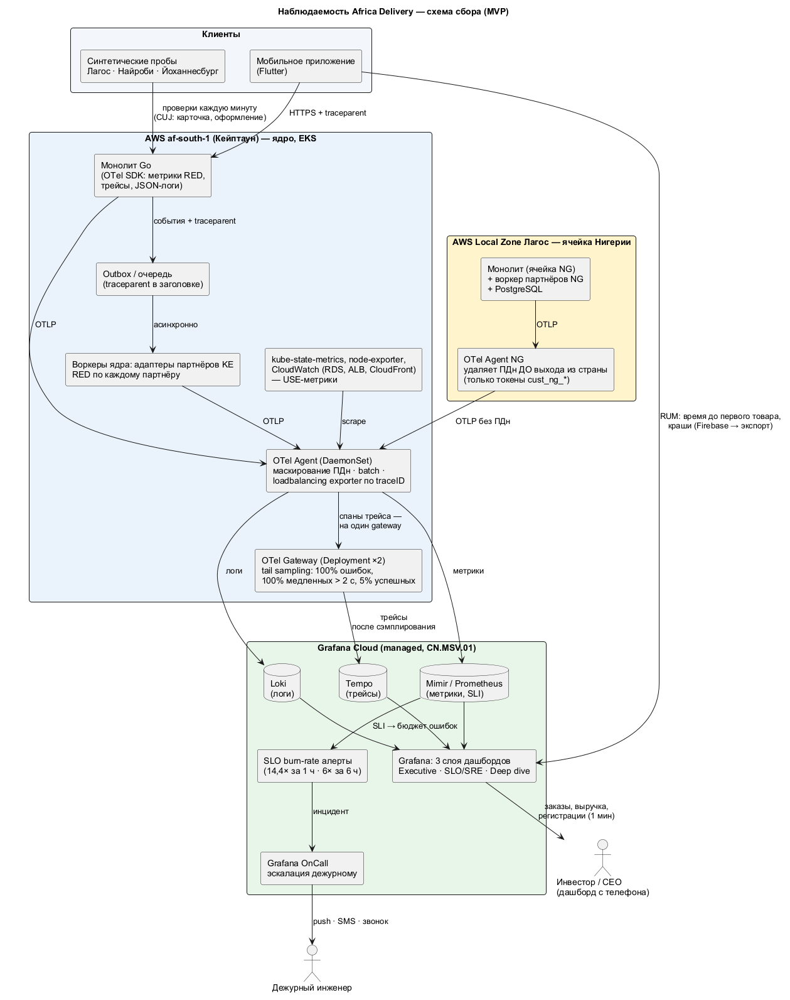

# Стратегия наблюдаемости

**Дата (время кейса):** 2026-08-25. **Цель:** дежурный инженер по сигналу понимает, что сломалось и где, а не только *что* сломалось. Инцидент определяется формально — это сработавший алерт скорости сгорания бюджета ошибок SLO.

## 1. Схема сбора

Исходник: [observability.puml](observability.puml).

- **Инструменты:** OpenTelemetry SDK (Go) → **OTel Agent** (DaemonSet: маскирование ПДн, batch) → **OTel Gateway** (Deployment ×2, tail sampling) → **Grafana Cloud**: Mimir/Prometheus — метрики, Loki — логи, Tempo — трейсы, Grafana OnCall — эскалации. Это managed-стек по CN.MSV.01, дешевле своей эксплуатации при шести людях (≈ $150/мес в TCO). Стек совместим с OSS-версиями, поэтому выход — self-hosted в кластере, если счёт вырастет больше $1 000/мес. Чек-лист CTO (A5: OTel, Prometheus, Grafana, Loki, Jaeger→Tempo) выполнен.
- **Мобильный клиент:** Firebase Crashlytics и Performance (бесплатно): краши, холодный старт, трейс `first_product`.
- **Синтетика:** проверки критических путей пользователя каждую минуту из Лагоса, Найроби и Йоханнесбурга.
- **Резидентность:** коллектор ячейки Нигерии удаляет ПДн **до** выхода из страны — наружу уходят только токены `cust_ng_*` (NFR-16). Логи пишутся без ПДн на источнике (структурированный JSON, PII-поля маскируются).

## 2. Четыре золотых сигнала по сервисам

| Сервис / адаптер | Latency (задержка) | Traffic (трафик) | Errors (ошибки) | Saturation (насыщение) | SLI |
|---|---|---|---|---|---|
| Каталог (API + CDN) | `http_server_duration_seconds{route="/v1/products*"}` p50/p99 | RPS origin, `cdn_requests_total` | 5xx origin; edge-ответы не 2xx/304 | CPU подов vs limits; hit ratio CDN и Valkey; пул соединений БД | SLI-CAT-1, 2 |
| Оформление и платежи | p99 `POST /orders`, `/payments` (без PSP); время до подтверждения оплаты и продавцом (`order_payment_secured_seconds`, `order_seller_confirmed_seconds`) | Заказов/мин, платежей/мин по PSP | 5xx, `payments_reconciled_total{result="mismatch"}`, зависшие заказы (`orders_stuck_total`) | Длина Inbox вебхуков; блокировки в PostgreSQL; занятость соединений | SLI-PAY-1…3, 5…8 |
| Уведомления | Время «событие → шлюз» | Сообщений/мин по каналам | Отказы шлюза, DLR `failed` | Возраст старейшего сообщения в очереди; лимиты BSP | SLI-NOT-1…4 |
| Адаптеры PSP (M-Pesa, Flutterwave, Paystack) | p99 вызова PSP | Вызовов/мин | Тайм-ауты, отказы, состояние Circuit Breaker | Занятость пула Bulkhead | SLI-PAY-4 |
| Адаптеры логистики (Sendbox, KE) | p99 создания отправки | Отправок/мин | Отказы, «зависшие» > 15 мин | Возраст очереди отправок | — (FMEA 03, 04) |
| Инфраструктура (USE) | Задержка дисков RDS | IOPS, сетевой трафик | Ошибки узлов и подов (OOMKilled, рестарты) | CPU/RAM узлов, соединения RDS, место на дисках | Нагрузочный тест |

Методика: **RED** — для модулей и адаптеров, **USE** — для инфраструктуры. Кардинальность метрик ограничена: никаких `user_id` и `order_id` в лейблах, только `route`, `psp`, `country`, `code`.

## 3. Метрики → SLI → бюджет ошибок → алерт

| Шаг | Как |
|---|---|
| SLI | Отношение «хорошие / все» из метрик (PromQL в SLO-контрактах [slo/](slo/)), окно 28 дней |
| Бюджет ошибок | 1 − SLO; запись `slo:error_budget_remaining` по каждому SLO |
| Алерт (paging) | Скорость сгорания 14,4× за 1 ч **и** за 5 мин, или 6× за 6 ч **и** за 30 мин (multi-window, Google SRE Workbook) |
| Алерт (тикет) | 1× за 3 дня |
| Инцидент | Сработал paging-алерт → Grafana OnCall → дежурный (push, SMS, звонок). Уровни: SEV1 — оформление или платежи; SEV2 — каталог, уведомления; SEV3 — бэк-офис |
| После инцидента | Пост-мортем без поиска виноватых за 48 ч, «5 почему», action items в бэклог. При исчерпании бюджета — feature freeze |

## 4. Логи и трейсы

- **Логи:** структурированный JSON (`trace_id`, `span_id`, `module`, `country`, `order_token`). Уровень INFO для успешных запросов сэмплируется (10%), ошибки — 100%. Хранение 14 дней горячих и 90 дней архива. Журнал аудита платежей — отдельно, 7 лет, в стране субъекта (ADR-003).
- **Трейсы:** контекст W3C `traceparent` передаётся по HTTP, **в заголовке события outbox** и в адаптерах партнёров — цепочка «приложение → монолит → outbox → адаптер → PSP-вебхук» не рвётся. Tail sampling: 100% ошибок, 100% запросов > 2 с, 5% остальных. Он работает **только на gateway-слое**: агент в DaemonSet видит спаны лишь своего узла, поэтому отправляет их через `loadbalancing` exporter с ключом traceID — все спаны одного трейса попадают на один gateway.
- **Корреляция:** из алерта → дашборд SLO → exemplar трейса → логи по `trace_id`. График RPS строится из метрик, а не из логов («Повышение надёжности системы», S9).

## 5. Дашборды (3 слоя)

| Слой | Для кого | Что показывает |
|---|---|---|
| Executive | Инвестор, CEO (с телефона, A2) | Регистрации; воронка заказов **создано → оплачено или принято к оплате наличными → подтверждено продавцом** (критерий Vision — «≥ 1 000 **оплаченных** заказов/день»); GMV по оплаченным; выплаты продавцам; зависшие заказы (SLI-PAY-7) и отдельной строкой — ждущие оплаты по ссылке (`AWAITING_CUSTOMER_PAYMENT`). Обновление 1 мин, бизнес-метрики из событий (не из логов) |
| SLO / SRE | Дежурный, CTO | Бюджеты ошибок по SLO, золотые сигналы, состояние Circuit Breaker партнёров |
| Deep dive | Инженеры | USE инфраструктуры, БД, кеши, очереди |

## Assumptions

- **AS-28.** Grafana Cloud не размещает данные в Африке, поэтому ПДн в телеметрию не попадают совсем: маскирование на источнике и в коллекторе обязательно.
- **AS-29.** Стоимость наблюдаемости ≈ $150/мес в Г1 (TCO, блок 2). При > $1 000/мес — переход на self-hosted.
