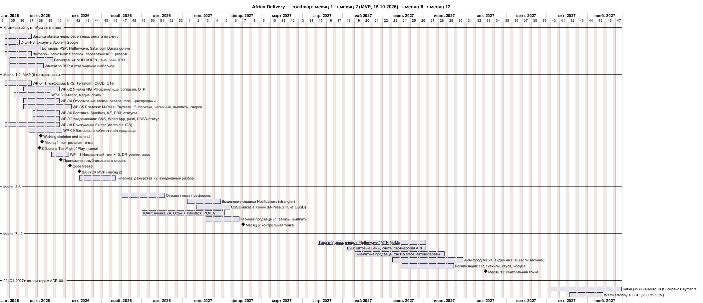
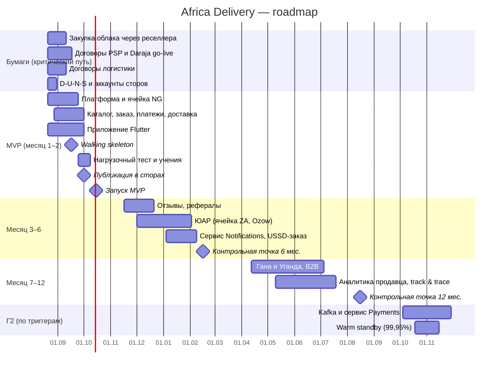

# Roadmap: месяц 1 → месяц 2 (MVP) → месяц 6 → месяц 12

**Дата (время кейса):** 2026-08-31. **Ограничения:** 8 недель до 15.10, ≤ $5 000/мес первые 6 месяцев, 6 контракторов и заморозка найма до декабря (A6 п.1, п.5). **Цифры** — из [Task2/tco-model.xlsx](../Task2/tco-model.xlsx), вариант A.

Исходник: [roadmap.puml](roadmap.puml) (PlantUML Gantt). Ниже — тот же план в Mermaid.

## Четыре контрольные точки

| | **Месяц 1** (17.09.2026) | **Месяц 2 — MVP** (15.10.2026) | **Месяц 6** (15.02.2027) | **Месяц 12** (16.08.2027) |
|---|---|---|---|---|
| **Scope** | Walking skeleton: товар найден, заказан, оплачен (sandbox M-Pesa, Paystack и Flutterwave), передан Sendbox, выплата продавцу. Сборка в TestFlight и Play Internal. Подписаны договоры PSP и логистики | 8 функций MVP (таблица ниже); Лагос и Найроби; 100 продавцов и 5 000 SKU; SLO 99,9% | + ЮАР (Ozow, Paystack, POPIA), USSD-заказ в Кении, отзывы, рефералы, кабинет продавца v1. Notifications — отдельный сервис | 5 стран (+ Гана, Уганда), 1 млн+ пользователей, B2B, аналитика продавца, track & trace, автовозвраты, антифрод ML, видео на ПВЗ (если законно), FR + местные языки. Отдельный сервис партнёрского API. Kafka, сервис Payments и warm standby (99,95%) — следующим шагом, в Г2 (Q4 2027), по триггерам |
| **Команда** | 6 контракторов + CTO + архитектор | 6 + гиперкеа (дежурства ×2) | 8: заморозка снята в январе, +1 backend, +1 QA/SRE | 11: 9 разработчиков + 2 SRE (TCO, Г2) |
| **Инфраструктура, $/мес** (облако + SaaS) | ≈ $1 200 (staging + каркас prod) | ≈ $3 700 при запуске (в среднем за Г1 — $4 338, с окружениями dev/stage) | ≈ $4 700 (≤ $5 000 ✓) | ≈ $11 400 — среднее Г2 по TCO (5 стран, затем Kafka и warm standby); та же цифра — в стоимости заказа месяца 12 |
| **Решение «идём / стоп»** | Без walking skeleton к 17.09 — режем скоуп по списку «первым под нож» | Чек-лист готовности: нагрузка ×10, DR-учение, сторы, сверка | Пересмотр SLO и триггеров ADR-001 | Пересмотр своей логистики и прямого эквайринга (ADR-004) |

## Ёмкость MVP

6 человек × 8 недель = **48 чел-нед**. План — **43 чел-нед**, буфер 5 (≈ 10%) — мал. Поэтому заранее определён список **«первым под нож»**:

1. флеш-распродажи → таймер и ручная цена, без резерва остатка;
2. USSD-статус → только SMS;
3. кабинет продавца → загрузка CSV через оператора;
4. наличные курьеру → только Лагос;
5. **Последним и только с согласия инвестора:** Paystack → сразу после запуска. Резерв в Нигерии на 2–3 недели — наличные и «оплатить позже по ссылке». Если этот пункт сработает, обещание слайда «второй PSP в каждой стране» в Нигерии временно не выполняется, и это сообщается инвестору до запуска.

| WP | Работа | Чел-нед |
|---|---|---|
| 01 | Платформа: EKS, Terraform, CI/CD, OTel | 4 |
| 02 | Ячейка NG, PII-хранилище, согласия, OTP | 4 |
| 03 | Каталог, медиа, поиск | 4 |
| 04 | Оформление заказа, резерв, флеш-распродажи | 4 |
| 05 | Платежи: M-Pesa, Paystack, Flutterwave, наличные, выплаты, сверка | 7 |
| 06 | Доставка: Sendbox, KE, ПВЗ, статусы | 4 |
| 07 | Уведомления: SMS, WhatsApp, push, USSD-статус | 3 |
| 08 | Приложение Flutter (Android + iOS), каркас i18n | 7 |
| 09 | Бэк-офис (OSS-админка) и кабинет-лайт продавца | 3 |
| 10 | Дашборд CEO (Grafana) | 1 |
| 11 | Нагрузочный тест ×10, DR-учения, хаос | 2 |
| | **Итого** | **43** |

## 29 функций Product Manager: что вошло и по какому критерию

**Критерий отбора в MVP** — все четыре условия одновременно:

- **К1** — функция на критическом пути одного из четырёх слов инвестора: «люди покупают, продавцы получают деньги, ничего не ломается, министр не звонит» (A1), **или** прямо названа в MVP-скоупе (У);
- **К2** — её нельзя на 2 месяца заменить партнёром или ручным процессом;
- **К3** — помещается в ёмкость 43 из 48 чел-нед;
- **К4** — не требует лицензии, которой нет (A3 п.4), и не несёт правового риска.

Если не выполняется К4 — «не делаем». Если не выполняется К2 — обходной путь.

| # (A4) | Функция | Решение | Почему |
|---|---|---|---|
| 1 | Каталог, неограниченные категории и атрибуты | **MVP** (урезано: 3–5 категорий, шаблоны атрибутов) | К1–К4; «неограниченно» не нужно для 5 000 SKU |
| 2 | Полнотекстовый поиск с опечатками на 5 языках | **MVP** (урезано: английский, pg_trgm) | К1; языки — 12 мес. |
| 11 | Оплата: M-Pesa, Flutterwave, Paystack, карта, перевод, наличные | **MVP** (M-Pesa в Кении; Paystack — основной и Flutterwave — резервный в Нигерии; наличные в Лагосе и Найроби); банковский перевод — через PSP | К1 — «продавцы получают деньги»; ADR-004 |
| 16 | Флеш-распродажи с таймерами и резервом | **MVP** | Обещание недели запуска (A2), корректность остатков |
| 18 | Отслеживание, живая карта, ETA до минуты | **MVP** (урезано: статусы партнёра); карта — 12 мес. | К1 «доверие»; track & trace — цель 12 мес. (У) |
| 19 | ПВЗ с видеофиксацией | **MVP** (ПВЗ партнёра, без видео); видео — 12 мес. | Нет адресов (У); законность видео не проверена (A4) |
| 26 | Бэк-офис: модерация, KYC, споры, возвраты | **MVP** (минимальный, OSS-админка) | Значок «проверено» (A2), KICA, возвраты |
| 28 | Дашборд руководства в реальном времени | **MVP** (Grafana) | В MVP-скоупе (У), A2 |
| 5 | Live-стримы с покупкой и чатом | **Обходной путь:** стримы в TikTok и YouTube + диплинк на карточку | К2 — партнёр закрывает обещание 7 (A2) |
| 8 | Онбординг продавца через WhatsApp | **Обходной путь:** онбординг 100 продавцов делает оператор; заказы продавцу идут в WhatsApp. Полный сценарий — 6 мес. | К2; уведомления в WhatsApp есть в MVP-скоупе (У) |
| 20 | Возвраты 30 дней, мгновенный возврат денег | **Обходной путь:** заявка в приложении + ручной процесс; «мгновенно» — баллами (C-08). Автоматизация — 12 мес. | К2; кассовый разрыв и фрод |
| 21 | ML-антифрод | **Обходной путь:** риск-движки PSP + лимиты наличных. ML — 12 мес. | Без данных ML бесполезен |
| 24 | Офлайн-заказ по USSD и SMS | **Обходной путь:** USSD-статус и подписка на акции; заказ по USSD (Кения) — 6 мес. | К3 |
| 25 | PWA + iOS + Android с полным паритетом | **Обходной путь:** одно Flutter-приложение (Android + iOS); PWA — 12 мес. | К3: паритет трёх платформ втрое дороже |
| 7 | Отзывы с фото и видео | 6 мес. (текст), 12 мес. (медиа) | Не критический путь |
| 15 | «Колесо фортуны», ежедневные награды | 6 мес. | Не критический путь |
| 23 | Партнёрская и реферальная программа | 6 мес. | Рост, не запуск |
| 4 | ИИ-рекомендации | 6 мес. (правила), 12+ мес. (ML) | Нет данных |
| 10 | Кабинет продавца с аналитикой, когортами, прогнозом | 6 мес. (v1), 12 мес. (аналитика) | Цель 12 мес. (У) |
| 9 | Онбординг продавца через USSD | 12 мес. | Пилотные 100 продавцов — с WhatsApp |
| 22 | B2B: опт, счета, отсрочка | 12 мес. | Цель 12 мес. (У) |
| 27 | Публичный GraphQL API | 12 мес. (REST; GraphQL — по спросу) | Нужен для B2B |
| 3 | Голосовой поиск на суахили и хауса | 12+ мес. | Нет данных о спросе, высокая стоимость |
| 6 | Чат покупатель — продавец с автопереводом | 12+ мес. | Риск увода сделок с платформы |
| 29 | Тёмная тема | 12 мес. | Не влияет ни на одно из четырёх слов |
| 12 | Рассрочка с собственным скорингом | **Не делаем** сами; позже — партнёр BNPL | К4: кредитная лицензия |
| 13 | Мультивалютный кошелёк и P2P | **Не делаем** | К4: лицензия на электронные деньги (A3 п.4) |
| 14 | Лояльность на криптотокенах | **Исследование** после product-market fit | A1: «не к октябрю»; регулирование |
| 17 | Динамическое ценообразование по парсингу Jumia | **Не делаем** | К4: правовой риск парсинга |

**Итог:** **8 из 29** в MVP (урезанные), 6 — обходным путём без разработки, 11 — на 6–12+ мес., 4 — не делаем или исследуем. Сокращение согласовывается с CEO и инвестором в Найроби — Том просил ничего не выбрасывать без инвестора (A4).

**Язык интерфейса** (A2 обещание 5 «Покупай на своём языке»; в 29 функций не входит, C-14). На запуске — английский, суахили, хауса и йоруба: строки вынесены в ресурсы (каркас i18n в WP-08), переводят переводчики маркетинга, вычитывают носители. Поиск — только английский (функция 2), французский — с выходом во франкоязычные страны. Запас: английский + суахили и меню USSD на местных языках, если переводы не вычитаны к 01.10. Ёмкость разработки не меняется.

## Assumptions

- **AS-41.** Контрольные точки отсчитываются от старта работ 17.08.2026; месяц 2 = запуск 15.10.
- **AS-42.** Заморозка найма снимается в январе 2027 (A6 п.5: «до декабря»). Найм +2 к месяцу 6 укладывается в TCO (Г1 — в среднем 7 FTE).
- **AS-43.** Гана и Уганда — допущение о двух странах сверх NG/KE/ZA к 12 мес. (У: «пять стран»). Выбраны по покрытию Flutterwave и MTN MoMo.
